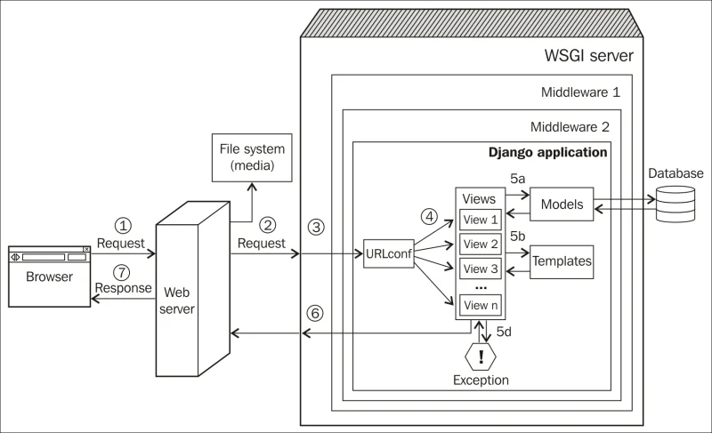

# tutorial-django

1. [Pelaran ke-1: Django Request, Response, Models dan Admin.](https://github.com/dosenjelata/tutorial-django/tree/P1-mulai)
2. Pelajaran ke-2: Django Views, Forms dan Template.

Gambar 1. Arsitektur Django